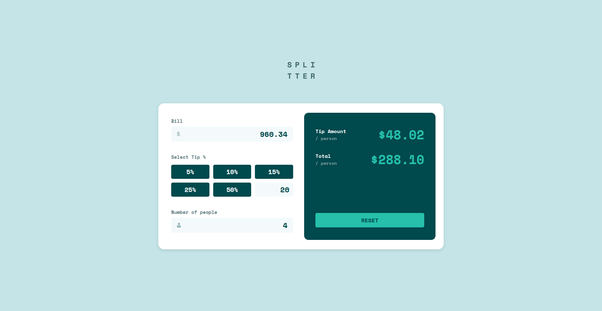

# Frontend Mentor - Tip calculator app solution

This is a solution to the [Tip calculator app challenge on Frontend Mentor](https://www.frontendmentor.io/challenges/tip-calculator-app-ugJNGbJUX). Frontend Mentor challenges help you improve your coding skills by building realistic projects.

## Table of contents

- [Overview](#overview)
  - [The challenge](#the-challenge)
  - [Screenshot](#screenshot)  
  - [Links](#links)
- [Built with](#built-with)
- [Author](#author)

## Overview

### The challenge
 
Users should be able to:

- View the optimal layout for the app depending on their device's screen size
- See hover states for all interactive elements on the page
- Calculate the correct tip and total cost of the bill per person

### Screenshot

### Links

- Solution URL: [Frontend Mentor Solutions](https://www.frontendmentor.io/solutions/tip-calculator-app-Owlq2y-3Cb/)
- Live Site URL: [Github Pages](https://sam4web.github.io/tip-calculator-app/)

## My process

### Built with

- [Vue](https://vuejs.org/) 
- TypeScript
- Semantic HTML5 markup
- CSS custom properties
- Flexbox
- CSS Grid
- Mobile-first workflow

## Author

- Website: [Sijal Manandhar](https://sijalmanandhar.com.np/)
- Frontend Mentor: [@sam4web](https://www.frontendmentor.io/profile/sam4web)
- Github: [@sam4web](https://github.com/sam4web)
